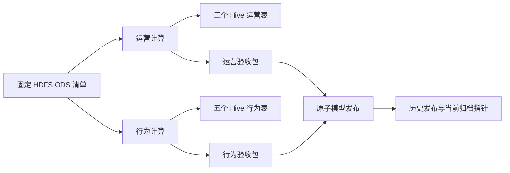

# 可暂停的表级血缘

目前覆盖 `snow_models` 的运营计算、行为计算和私有模型发布。运行时自动记录 OpenLineage 2-0-2 的 START、COMPLETE、FAIL，Marquez 0.50.0 保存并查询这些记录。采用显式映射：数据集身份来自固定输入清单、通过校验的 Hive 表名和真实发布文件；不是 SQL 自动解析或列级血缘。



上图说明代码覆盖范围；真实图必须从 Marquez API 读回核对。计算读取的原始批次由 ODS 清单确定，本轮只把该清单作为源数据集，尚未补齐 Kafka Topic 到每个 HDFS 批次的血缘。发布任务读取 JSON 验收包，不直接读取 Hive，因此没有虚构 Hive 查询边。

## 独立边界与生命周期

- `SNOW_LINEAGE_ENABLED` 默认 false。开启后只写独立实验目录的 SQLite 日志，没有网络请求；轻量统计与两个产品均不导入血缘模块。
- `SNOW_LINEAGE_DB` 在 Airflow 容器中指向 `/opt/snow/runtime/publication/lineage.sqlite`。每条事件都有内容校验和，事务提交后保留。数据库限制 16 MiB，DELETE journal 的临时回滚文件另需最多相近空间；不会自动删除已记录事件。
- UUID 由作业名与 Airflow 运行/尝试编号稳定生成。同一尝试的重复记录复用身份，重试使用新身份；一次运行只能有一个终态。只有通过校验的完成任务声明输出，失败不声明已发布结果。
- 数据库不可写或达到容量限制时，计算照常继续，标准错误输出 `snow_lineage_capture_failed`，包含阶段和异常类型，不包含错误正文、SQL、凭据或业务内容。血缘此时存在缺口，不能报告完整覆盖。
- Python 异常被捕获时写 FAIL；强制 kill 或宿主故障可能留下 START。`status` 显示这些未结束运行，不按“时间长”推测失败。`reconcile-failed` 只根据只读导出的 Airflow `failed` / `up_for_retry` 状态补记对应尝试的 FAIL；成功任务丢失终态仍需核对验收包或重新执行新运行，不能冒认完成。

协议要求每次运行有开始和终止事件，见 [OpenLineage 2-0-2](https://openlineage.io/spec/2-0-2/OpenLineage.json)。本轮没有安装 Airflow provider 或 Spark 自动提取插件，也没有声明父子作业、字段依赖或全部引擎覆盖。

## 分阶段投递

先按[行为模型手册](behavior-models.md)完成计算。在控制节点 `lab/.env` 设置 `SNOW_LINEAGE_ENABLED=true` 后重建 Airflow 容器。默认重试间隔 300 秒；故障实验可设置 `SNOW_AIRFLOW_RETRY_SECONDS=15`，合法范围 10..600 秒，结束后恢复默认。

Marquez 无需与三台计算 VM 同时运行。暂停 DAG 并停止活动任务后，使用 SQLite backup API 导出一致的日志副本，再通过受验证 SSH 传至分析节点，避免复制正在写入的数据库。计算/治理资源切换由操作者执行，不能跨过项目容量门禁。

控制节点导出命令：`python3 governance/lineage.py backup --snapshot runtime/lineage/delivery.sqlite`。输出文件必须是新路径，避免覆盖其他批次；导出包含已确认记录，接收副本延续已有投递位点。

分析节点关闭 DataNode / Doris 后，配置 `governance`（2 GiB）并启动 `tools/start_governance_node.sh`。Marquez 和 PostgreSQL 使用已锁定镜像，API 仅绑定该 VM 的 `127.0.0.1:5000`，数据库不映射宿主端口。配置关闭未使用的 OpenSearch 与 GraphQL，JVM 堆 512 MiB，Marquez/数据库容器上限分别 1 GiB/384 MiB。

在分析节点项目目录执行：

```bash
python3 governance/lineage.py status --database runtime/lineage/delivery.sqlite
python3 governance/lineage.py flush --database runtime/lineage/delivery.sqlite
python3 governance/lineage.py export-acks --database runtime/lineage/delivery.sqlite --receipt runtime/lineage/acks.json
```

每批默认最多 100 条；投递端单写者锁、5 秒 HTTP 超时，按本地序号发送，在成功响应后才记录确认。失败立即停止该批，后续手动重试。确认前崩溃会重发同一 UUID、状态、时间和内容，属于至少一次投递；Marquez 图与运行状态是否保持一致须通过实际读回验证，不承诺服务器内部事件日志无重复。

将确认文件传回控制节点，然后执行：

```bash
sudo python3 governance/lineage.py import-acks --receipt runtime/lineage/acks.json
python3 governance/lineage.py status
```

控制节点日志由 Airflow UID 50000 写入，普通 SSH 用户可导出但不能修改；导入确认以管理员身份执行，不改变数据库归属。只有序号和 SHA256 都匹配本地日志才接受确认，原始日志始终保留。`--target` 默认 `snow-lab-marquez-v1`，代表本次持久后端；如果删除或重建 Marquez 数据库，必须更换 target 重新投递，不能复用旧确认来宣称新库完整。

需要模拟 HTTP 已接受、确认未落盘时，可对待投递日志使用 `flush --fail-after-send`，随后正常重试。使用 `tools/airflow_receipt.py --dag-id snow_models --run-id <名称>` 导出实际任务状态后，才能将它传给 `reconcile-failed --receipt <文件>`。

`tools/verify_lineage_backend.py --database <日志副本> --output <归档.json>` 会逐个检查 Marquez 运行状态及输入/输出数据集版本，并读回最近依赖图。将归档同步为本机 `runtime/lineage/backend-final.json` 后，Streamlit 选择“Marquez 血缘归档”，无需启动虚拟机即可查看图和失败尝试。

治理阶段曾以 `ods-compact`（3.5 / 3 / 1 GiB）完成同一小样本 DAG，保留 1 GiB 作业前余量；治理使用分析 VM 2 GiB。此后实时镜像与数据继续增长，这个三 VM 组合已不能直接满足当前 60 GiB 预算。这里保留历史验收条件，重现前必须按[最新运行手册](runbook.md)检查容量，不能沿用当时的可用空间估计。

后续 `scale`（2/2/1 GiB）完成了 10 万条日指标 YARN 计算，但治理、Hive、Airflow 均关闭；未验证本页 DAG 或血缘在此配置下运行，见[扩样记录](scale.md)。

## 保留和退出

Marquez 与 PostgreSQL 的卷、日志和确认副本登记在 `deploy/resources.json`；关闭服务不删除数据。原有轻量汇总与模型归档不需要 Marquez 在线。清理必须先导出所需事件、运行状态和图，再按独立资源清单审阅。

版本配置参考 [Marquez 0.50.0 配置](https://github.com/MarquezProject/marquez/blob/0.50.0/marquez.example.yml)及[官方入口](https://github.com/MarquezProject/marquez/blob/0.50.0/docker/entrypoint.sh)。运行状态与图使用[官方 API](https://marquezproject.ai/docs/api/get-lineage/)读回，已验证范围见[实施状态](status.md)。
