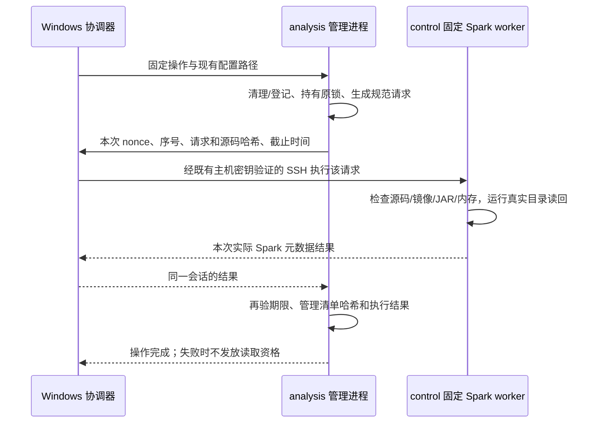

# 在 control 执行、由 analysis 管理的 Hive 操作

本入口是**候选实现**：有合成协议、目录范围、恢复和超时测试；尚未在 VMware 上完成本入口的 Spark/Hive 联调。不能把本页当作新的实际引擎回执。既有正式 Flink writer 文件及其冻结哈希不改，analysis 不下载 Spark/Hive 镜像、不接收 control 私钥。

## 为什么需要 Windows 协调会话

analysis 保存真实数据资源清单、原始期限、ODS 位点、已发布聚合和 writer 身份。control 已有锁定的 Spark 镜像与 334 个 Hive 客户端 JAR。现有 `SparkCatalog` 默认在调用节点执行，所以裸 `real_lab cleanup/permit` 和裸私有看板遇到已登记 Hive 后，仍会因 analysis 缺客户端而拒绝读取。

独立入口为当前进程安装 `catalog_runner_context()`。analysis 的登记和清理代码每次需要 Hive 时，同步发送一个规范 JSON **元数据请求**；Windows 使用已有、严格验证主机密钥的 SSH 实际调用 control worker，再通过原会话回送本次执行结果。请求只含表名、已登记位置、来源代际、原到期时间、聚合行数及哈希，不含聚合行、匿名标识或聊天内容。



这里信任的是本机受控协调器与已校验主机密钥的两台 VM，而非外部上传的“成功回执”。公开 CLI 没有 `--success-json`、任意 SQL、任意脚本或结果文件参数。内部 worker 只接受受限操作描述并实际运行，不接受结果代替执行。nonce、单调序号和规范请求哈希防止误混会话及复用旧响应；它们不是对被完全控制的主机进行远程可信计算证明。

## 前置条件与资源窗口

执行位置：**Windows PowerShell**；工作目录是当前 Snow_Statistics 仓库。使用已存在的 `runtime/real/config/production.json`，不得把示例配置改成另一个来源来绕过正式身份检查。

1. 两台 VM 已安装同一候选源码，包含新 dispatch 模块、工具和 Hive worker。VM 的 `.venv` 已通过 `pip install --no-deps -e .` 指向这份源码。入口会核对 11 份明确列出的源码/锁文件哈希，不把 control 的目录状态文件复制为 analysis 权威清单。
2. control 已缓存锁定 Spark 镜像及完整 Hive JAR。脚本使用 `--pull=never`。缺少缓存时停止，不拉取或复制镜像以试探容量。
3. 真实 writer 已按正常 pause/stop 流程停止，或已完成其原到期后的实际物理退役。不能把运行中的 Kafka/Doris/Flink伪装成“未初始化”。
4. 已有有效、登记过原 90 日期限的真实聚合发布物。未闭合的今天、空 ODS、缺失数据不会由这个工具补成零。
5. 新的 Hive/Iceberg 连续验收采用 `real-small-1920`：control 2048 MiB、compute 1920 MiB、analysis 768 MiB，总计4.625 GiB。该配置的56条合成离线样例已通过，**Hive窗口仍待实际验证**。目录阶段 control 只运行 NameNode + Hive；compute、analysis各保留原 DataNode，ResourceManager和NodeManager停止。保持已存在的磁盘卷，禁止 `down -v` 或全局清理。独立历史 [hive-only 容量设计](real-hive.md)不是这套连续阶段配置的实际成功证据，不能混用其节点内存和副本状态。
6. control 运行目录 worker 前仍必须实际有至少 768 MiB `MemAvailable`。当前 2 GiB control 能否同时满足 NameNode、metastore 与这个门槛，**仍待实测**。不能降低门槛、扩内存或降低副本要求来让候选“通过”。连续阶段始终保留两台DataNode并检查实际存活；每台来宾保持至少128MiB可用内存，不能只依据容器配额推断实际余量。
7. 每次启动执行保留 256 MiB 项目空间，原 64 GiB 项目、35 GiB 宿主空闲磁盘、4 GiB 宿主可用 RAM 门槛不变。取消已启动 worker 的固定 SSH 不受启动空间门槛阻拦。

这些操作不启动/停止 VM，也不会自动切换 Hive、YARN 或业务产品。资源窗口不满足即失败，保留现有状态。

Windows 协调器、analysis 管理进程和 control 目录 worker 在新读取前，还会清理各自 `runtime/real/lake-authority` 中已登记的湖仓聚合副本，沿用最初 90 日期限。登记不全、到期删除失败或路径异常都会阻止新读取；精确取消不依赖这些清理成功，避免故障反过来挡住收尾。

## Windows 操作

先清理并实际检查所有已登记来源副本：

```powershell
uv run python tools/real_hive_dispatch.py --config runtime/real/config/production.json --operation cleanup
```

为已经在 analysis 受管理目录中的聚合发布物登记外部表，再独立核验。将下面 `accepted_run_id` 替换为实际已发布批次，不使用猜测日期：

```powershell
uv run python tools/real_hive_dispatch.py --config runtime/real/config/production.json --operation register --run-id accepted_run_id
uv run python tools/real_hive_dispatch.py --config runtime/real/config/production.json --operation verify --run-id accepted_run_id
```

`register` 先写 analysis 的登记意图，再做完整清理、真实 Spark/Hive 建表和聚合哈希读回，最后再次完整清理。重试不能改变表位置、来源或原期限。`verify` 不创建缺失表。外部表的到期删除仅移除目录引用；HDFS 内容由原真实资源清单清理，二者不能互相替代。

若已有受控的真实作业配置，需要重新签发计算 permit：

```powershell
uv run python tools/real_hive_dispatch.py --config runtime/real/config/production.json --operation permit --run-id accepted_run_id
```

它仍执行现有原始输入、清理和期限检查。7 日原始数据已过期后不能借这个入口生成新的计算 permit；仍在 90 日期限内的已发布聚合只能按聚合读取门禁访问。

`--operation catalog-cleanup` 只检查/清理 Hive catalog，不证明其他副本清理完成，不授予读取资格。通常使用完整 `cleanup`。

## 私有看板与控制台生命周期

```powershell
uv run python tools/real_hive_dispatch.py --config runtime/real/config/production.json --operation view --run-id accepted_run_id --duration-seconds 900
```

打开 `http://127.0.0.1:8502`。Windows 仅为这条 analysis SSH 会话建立本机回环端口转发；analysis 的 Streamlit 仅监听 `127.0.0.1:8501`。不创建 Cloudflare/Public Tunnel、不开放公网看板。

**保持此 PowerShell 控制台运行。** Streamlit 的脚本线程共享显式进程 runner，因而每次真实清理仍通过同一活跃 broker 调用 control。现有聚合看板最多 60 秒的进程内读取期限、每次渲染的原到期及清单变更检查保持生效；再次清理需要 Hive 时必须再次真实执行，不能读取上一轮 `hive-last-operation.json` 当作新准入。

默认会话为 900 秒，可设置 60–1800 秒。每次实际 Spark 启动需要超过 165 秒的剩余权限：预留 150 秒给进程组、输出管道及精确容器停止读回，再留 15 秒启动余量。因此 60 秒会话不能启动 Hive 读取，不会把短许可延长到 420 秒。worker 的执行预算取 420 秒与“本次原截止前剩余时间减清理余量”的较小值。

正常到时或按 Ctrl+C 结束，会关闭该会话与端口转发。断开时 analysis 会关闭本次 runner，未完成操作不产生成功确认；Windows 尝试经固定控制通道停止本次请求标记的确切 control 容器。无法核验其身份/停止结果时报告失败，不扩大删除范围。即使 Windows 断电，control 本地也有独立执行超时及容器清理；这部分故障路径仍需实际引擎演练，合成测试不能替代它。

再次查看时先恢复同一合格资源窗口并重新运行命令。裸 Streamlit、裸 `real_lab cleanup/permit` 不会自动发现或复用旧 broker，它们在缺少本地客户端时继续拒绝读取。线上公开统计页与这些本地入口无依赖。

## 与 Iceberg 协调器的关系

新 Iceberg 协调器在自己的 Windows 进程中调用 `HiveCoordinator.run("lake-prepare", ...)` 和 `run("lake-confirm", ...)`。这两种内部操作只能执行固定的 analysis prepare/confirm 函数；实际 Iceberg 验证结果的哈希仍由该协调器从当次 control SSH 取得。公开 Hive CLI 不提供手工指定该确认哈希的入口。

Hive catalog 要求 control 只有 NameNode + metastore；Iceberg 的 YARN worker 要求 NameNode + ResourceManager。目录 RPC 不自动越过这种互斥窗口。实际切换由独立、已审查的 Iceberg 固定阶段工具负责，且所有步骤必须留在原短许可内；不能以阶段切换为理由延长原 90 日期限或短执行截止。

## 失败、检查与继续

| 情况 | 预期行为和处理 |
|---|---|
| control 缺镜像/JAR或源码哈希不同 | 不启动目录读取；对照同一候选源码和已有锁定缓存，不能临时拉取镜像。 |
| control 可用 RAM 不足或同时有其他容器 | 明确拒绝；按已核准窗口停对应实验服务，再实际测量，不能跳过检查。 |
| SSH、源码、管理清单或期限在执行中变化 | 不确认结果，保留 analysis 原登记意图及失败清理状态；恢复后先完整 cleanup。 |
| 控制台中断、目录请求已执行但确认未返回 | 不能手工写 passed/receipt；恢复同一清单后重新真实 cleanup/verify。 |
| 出现未知同名容器、缺少原 cid 或标签不符 | 不停止未知资源；保存精确错误范围给操作者审核，不全局 prune。 |
| 已过原始 7 日但聚合未过 90 日 | 仍需实际退役/清理检查；可读现有合格聚合，不能恢复 writer 或重发原始计算许可。 |
| 没有有效发布批次或足够历史 | 显示暂无可读/可计算输入或暂停，不能伪造零值和留存率。 |

只检查 analysis 的 `runtime/real/lifecycle/<lane>/hive-last-operation.json` 及当前资源清单；control 的 `runtime/real/hive-dispatch/<session>/<sequence>/worker.json` 只记录本次元数据执行范围。它不是权威清单，也不能授权未来读取。所有错误日志、目录元数据留在忽略的 runtime 中，不上传公共 API。

验收至少包括：实际注册及独立读回、故意截断 SSH、短期限拒绝、超时确切停止、超容量仍可取消、control源码偏移、跨会话重放拒绝、窗口关闭后看板暂停，以及关机/到期后的首次清理。当前只报告本地合成检查；通过实际 VM 验收后应追加源码 SHA、运行 profile、内存/磁盘读回与 Spark application ID。
