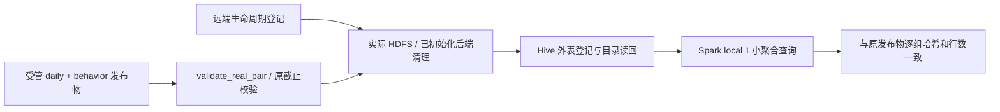

# 独立真实聚合 Hive 入口

2026-09-19：实现和合成测试完成，**实际 Hive 引擎验收待离线窗口执行**。本轮没有操作虚拟机或生产服务器。不要把配置、单测或历史 synthetic Hive 结果当作这条新链路的实测证据。

## 范围与数据流

Hive 保存的是「表名对应哪份数据、有哪些列和分区」的目录信息。原始 Parquet 已由实际 Spark/YARN 作业计算并存放在 HDFS；本入口不重复写入数据，也不把匿名明细搬进另一个系统。



只登记 `daily / session_daily / retention / funnel` 四组，指向已有 `ads_daily / session_daily / retention / funnel` 目录。会话、归因、匿名标识、请求级明细不进入这个入口。表名包含注册所有者和发布物的哈希，避免仅按 run ID 命名造成跨 lane 或代际冲突；完整哈希和 collector identity 仍在表属性内核验。

四组沿用原报表起始香港日期加 90 天的期限。登记、复制、重跑或服务重启不会延期。真实来源混入 synthetic、代际变化、表位置或分区位置变化、未知字段、原期限变化都会阻断。

## 文件与命令

- `tools/real_hive.py`：Linux 操作入口；读取与 `real_lab` 相同的严格配置，配置必须是私有 regular file，不可通过符号链接跳转。
- `src/snow_statistics/real_hive.py`：受管发布物验证、登记意图、生命周期适配器、固定子进程调用。
- `src/snow_statistics/real_hive_contract.py`：主机 Python 3.12 与 Spark 镜像 Python 3.8 共用的规范序列化和白名单。
- `src/snow_statistics/real_hive_spark.py`、`warehouse/spark/real_hive_catalog.py`：实际 Spark catalog/Parquet 操作；不接受任意 SQL。
- `tools/spark_hive_catalog.sh`：锁定镜像与 JAR 的临时客户端，结束或失败时仅收尾自身容器。

所有以下命令均在**配置指定的本地 Linux transport VM**，工作目录 `/home/snow/Snow_Statistics` 执行。生产 real 配置指定 `snow-analysis`；合成验收可使用已有明确标为 `synthetic fixtures` 的独立 transport 配置。不要在正式业务服务器运行，也不要在 Windows 直接调用执行阶段。

```bash
cd /home/snow/Snow_Statistics
.venv/bin/python tools/real_hive.py --help

# 替换成该 VM 上已有的私有 runner 配置；不是凭据正文。
.venv/bin/python tools/real_hive.py --config runtime/real/config/prod.json cleanup

# RUN_ID 必须已计算、validate_real_pair 验收并正式进入受管私有发布物。
.venv/bin/python tools/real_hive.py --config runtime/real/config/prod.json register --run-id RUN_ID
.venv/bin/python tools/real_hive.py --config runtime/real/config/prod.json verify --run-id RUN_ID

# 给已 prepare 的新真实 Spark 作业颁发既有短期 permit；仍做全部后端检查。
.venv/bin/python tools/real_hive.py --config runtime/real/config/prod.json permit --run-id NEXT_RUN_ID

# 只清理 Hive 到期目录引用，不读取行、不颁发读权限，也不声称 HDFS 已清理。
.venv/bin/python tools/real_hive.py --config runtime/real/config/prod.json catalog-cleanup
```

生产模式的发布物必须先用既有 `real_lab stage-release` 路径转移到 analysis，位于 `runtime/real/transfers/<lane>/<run_id>/published/`，有原 90 日期限登记和哈希。合成候选使用 `runtime/real/publication/`。不允许传任意「成功 JSON」或选择未登记目录来跳过检查。

没有 ODS 输入且从未初始化生命周期时，入口明确返回 `no_computable_input`，不创建零值报表。已经有登记资源却丢失 ODS 头时会失败关闭；不会把丢失当作没有数据。

## 运行前置条件

1. 已有锁定 Hive 3.1.3 metastore、原元数据卷及 HDFS；沿用 `tools/prepare_hive_client.sh` 准备的客户端和 `lab/locks/hive-client.sha256`。本入口不会下载镜像或自动启动服务。
2. 未到期 epoch 先暂停真实同步和 writer，保留完整、合法的恢复状态；工具使用实际 `StoppedStorage` 检查容器/卷、源、窗口和 ledger。已到期 epoch 改走下述实际物理退役检查；不能以「服务停了」冒充未初始化或 SQL 清理通过。
3. 在运行客户端的 VM 腾出独占窗口。analysis 不允许其他运行容器；control 仅允许已有 NameNode 和 Hive。因此 analysis 的 DataNode 需要在确认其他副本可读后按既有服务管理流程暂停。不要为本工具盲目停止它，HDFS 副本不足时先解决可用性问题。
4. Shell 要求 `MemAvailable >= 768 MiB`。客户端硬限制内存 768 MiB、1 CPU、128 PID，JVM 堆 512 MiB、`local[1]`、shuffle 1；这些是候选配置，尚未实测证明在当前 VM 组合下足够。整体仍遵守 64 GiB 项目、35 GiB 宿主空闲和 4 GiB 宿主可用 RAM 门槛。
5. `lab/.env` 只按四个允许值解析，不作为 shell 执行。容器只挂载代码、锁、Hadoop 配置、Hive client 和本次 metadata request；不挂载 reader token、SSH key 或完整 runtime。临时目录使用受限 tmpfs，事件日志关闭，根文件系统只读。

这是阶段安排要求，不是新的常驻 profile。工具自己只运行临时 Spark 客户端，不自动停业务或其他实验容器，不改变现有 VM 容量。

## 检查与失败行为

`register` 先持久化元数据登记意图，再登记 Hive 生命周期资源；即使中断，重试也不会丢失待清理范围。未实际创建的预登记表可以暂时不存在；已经验证的存活表消失则报错。`verify` 不创建缺失表。

完整清理要求实际执行 HDFS/ODS 处理和所有已初始化后端检查。Hive adapter 验证外表类型、Parquet provider、固定原始列、source、所有者属性、表位置、每个分区的位置及日期。分区详情的两条 `Location` 分别解析，不能用整表位置掩盖分区外逃。查询结果与原发布物按规范 ASCII JSON 排序哈希比较，同时检查精确行数；null 留存和空聚合组保留原语义。

到期清理仅对登记且所有权一致的外表执行精确 `DROP TABLE`，随后读回不存在。它不使用 `PURGE / CASCADE / DROP DATABASE`，也不负责删除 Parquet。HDFS 原件由 `RealRemoteLifecycle` 按自己的登记范围删除并读回；两者各自验收。

登记和操作元数据保存在 `runtime/real/lifecycle/<lane>/hive-catalog.json` 与 `hive-last-operation.json`。回执只包含元数据、行数及哈希，不保存明细或完整聚合行。输入 request 绑定实际字节哈希和 10 分钟期限；只接受当前固定 Spark 3.5.7、`local[1]`、Hive 3.1.3 和指定私有 metastore 地址返回的结果。

权限边界是本工具的路径、字段、来源和动作白名单以及私有 VM 网络。当前共享 Hive metastore 不提供本工具专属 RPC ACL；不能把这些检查描述为 Hive 多租户访问隔离，也不能把 metastore 暴露到公开 Tunnel。

## 已验证与待实测

本地执行：

```powershell
# Windows PowerShell，Snow_Statistics 仓库根目录
uv run python -m pytest tests/test_real_hive.py tests/test_real_remote_lifecycle.py tests/test_real_publication.py -q
uv run ruff check src/snow_statistics/real_hive.py src/snow_statistics/real_hive_contract.py src/snow_statistics/real_hive_spark.py warehouse/spark/real_hive_catalog.py tools/real_hive.py tests/test_real_hive.py
& 'C:/Program Files/Git/bin/bash.exe' -n tools/spark_hive_catalog.sh
```

55 项合成及相邻回归测试通过（其中 Hive 新增 37 项），Ruff、CLI 帮助和 shell 语法检查通过。覆盖混源、代际、原截止、未知路径/字段、外表类型、分区位置、空组、非 ASCII 哈希、部分登记恢复、目录丢失、DROP 读回失败、缺失旧 Hive 适配、子进程回执伪造、超时先通知自有进程组收尾、配置禁止任意 shell 等。

下一实际离线窗口必须验证：客户端资源峰值和 Jar 锁、远端 metastore 确实使用原持久卷、四组实际外表与已验收发布物一致、重启后注册保持、受控合成到期样例的目录/数据分别清理、失败后没有遗留读进程。保存真实 engine/application ID、配置/版本和输入来源，不沿用历史 synthetic 证据替代。

## 实时存储退役后的聚合读取

生产 epoch 的物理 7 日截止先于聚合 90 日期限。`real_retired.py` 已补齐这两个期限之间的代码路径：验证原 manifest、generation、初始化和作业登记、collector/Kafka 身份及历史文件哈希记录，调用实际 `Epoch.retire()` 精确删除或再次验证原容器/卷不存在，再扫描 Docker 全部容器和卷，拒绝同名重建、同 epoch 别名、标签或挂载旁路。历史核验不依赖旧 JAR 仍在磁盘上，不使用虚假时间调用存活 writer 的 `ready()`。

三个已初始化后端保留完整原登记，以 `retired_storage_absent` 回执证明物理范围已经消失。回执明确不给 writer 恢复、Checkpoint 恢复、原始计算或在线 SQL 清理声明。缺少登记、删除失败、回执被改写或资源重现时全部失败关闭。`RealRemoteLifecycle.issue_permit()` 即使发现新预留的 raw 路径仍未到期，也拒绝为这种退役状态签发计算许可。`catalog-cleanup` 仍只处理 Hive 引用，独立调用它不能获得读取许可。

HDFS/Hive 聚合和传输后的本地副本继续分别按各自原 90 日期限清理。私有看板经 `real_aggregate_read.py` 执行实际完整清理、受管发布物校验和已登记聚合路径检查后，才获得仅供当前进程使用、最多 60 秒的聚合读取许可。其期限同时受最早远端到期时间、本地目录最早副本期限和当前聚合原期限约束；页面每秒重判当前 lane 与发布目录的登记哈希、所有者和失败 gate/journal，发生变化立即丢弃缓存。这一步只读小型元数据文件，不扫描全仓库。资源阶段不可用时显示暂停和上次已验证截止，不自动启动 VM，也不填零；公开基础统计页不依赖这些检查。

本轮 Hive、退役适配、看板准入及相邻恢复/生命周期回归共 **164 项合成测试通过**，Ruff 和两个 CLI 的帮助检查通过。实际 Docker 退役、Hive catalog 与私有看板联合运行仍待后续离线窗口验收；合成替身不构成引擎验收回执。

## 官方版本依据

[Spark 3.5.7 Hive 表与 metastore 客户端](https://spark.apache.org/docs/3.5.7/sql-data-sources-hive-tables.html)、[DESCRIBE TABLE 文档](https://spark.apache.org/docs/3.5.7/sql-ref-syntax-aux-describe-table.html)、[该版本 DescribeTableCommand 源码](https://github.com/apache/spark/blob/v3.5.7/sql/core/src/main/scala/org/apache/spark/sql/execution/command/tables.scala)、[DROP TABLE 语义](https://spark.apache.org/docs/3.5.7/sql-ref-syntax-ddl-drop-table.html)用于核对接口和外表边界，不能替代实际引擎验收。
