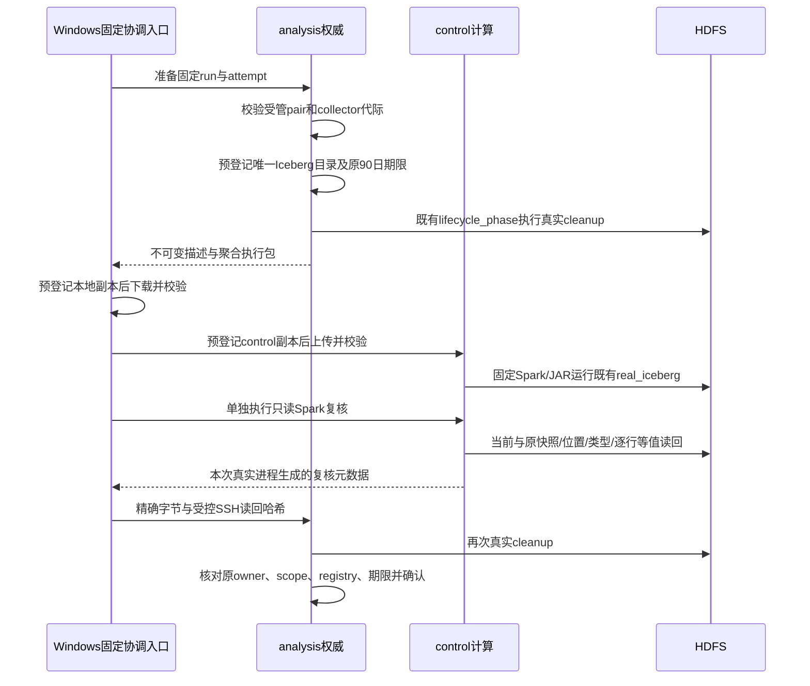

# 正式 Iceberg 的 analysis 权威交接

此入口解决正式拓扑的登记位置问题：生命周期权威、StoppedStorage 与真实 writer 在 analysis，Spark/YARN 作业在 control。不得把 analysis 的 registry 复制到 control 再声称完成同一权威检查。新增入口只复制经过验证的聚合执行包，既有 writer 文件不变。

本页记录实现和合成测试范围。尚未执行该新入口的实际三节点引擎验收，也没有真实闭日 Iceberg 成绩。2026-09-19 首次采集尚未形成自然闭日，不能倒填时间、覆盖声明或生产事件来制造当日报表；等香港时间9月20日以后按真实覆盖范围生成输入。

## 两条入口的适用范围

| 入口 | 适用布局 | 权威登记的位置 |
|---|---|---|
| `tools/run_real_iceberg.py` | 既有隔离 fixture，control 本地拥有同一 registry/backend 范围 | control；历史成功只证明该 fixture 布局 |
| `tools/real_lake_authority.py` | 新的 Windows 协调、analysis 权威、control Spark 布局 | analysis；control 只管理自己的短期副本和执行状态 |

旧工具保留兼容，没有替正式配置偷偷创建第二份权威。新入口的 `--run-id` 必须对应已经用现有 `stage-release` 接收到 analysis 的受管聚合对；`--attempt` 是本次 Iceberg 输出独立身份。

## 每一步实际上做什么



跨节点连接全部通过已有的 **Windows→VM** `tools/lab_remote.py` 和 seed 主机公钥。analysis 不需要向 control 建立 SSH，也不复制宿主或业务私钥。所有步骤都假设既有工作目录与私有运行文件由受信操作者控制；哈希用于内容绑定，不是硬件证明，也不能阻止拥有该账户写权限的人篡改程序本身。

analysis的prepare/confirm通过独立HiveCoordinator双SSH会话执行固定`lake-prepare/lake-confirm`操作。若cleanup遇已登记Hive，该会话把精确元数据请求交给control现有缓存完成真实catalog检查，analysis仍持有唯一registry。RPC没有跳过cleanup、复制registry或把JSON当后端适配器。

同一个Windows协调进程执行固定阶段切换：先在NameNode＋Hive阶段完成prepare，然后停止原Hive、启动原ResourceManager和NodeManager；实际写入与独立只读Spark复核成功后，停止原NodeManager和ResourceManager、恢复原Hive，再调用confirm。服务名、容器ID、镜像、Compose标签、挂载与配额逐步读回；仅对既有容器执行`start/stop`，不运行Compose `up`、不创建容器、不改VM配置。NameNode及两个DataNode在全程保持原ID、运行起点与重启次数，control还核对NameNode实际报告两台DataNode存活。

公开操作入口不接收“成功回执文件”参数。协调器必须先实际执行 control 的只读验证进程，随后经自己的受控 SSH/SCP 获得精确字节并转给 analysis。内部 `--node-phase` 是固定路由协议，不是手工补写成功记录的方法；不能跳过步骤，复制历史 `verify.json` 或自行填写布尔结果冒充验收。

## 描述、许可与原始期限

描述同时绑定：`source=real`、实际输入来源标签、lane、run、attempt、collector instance/generation、analysis owner 哈希、权威 registry 哈希、实际清理回执哈希、原聚合 pair 哈希、执行包字节数/哈希、输入哈希、固定执行脚本/镜像/JAR，以及唯一 HDFS 目录。

HDFS 目录固定为该 owner 的 `/snow/warehouse/real/<lane>/iceberg/<run>/<attempt>` 子树，不接受任意 SQL、任意 shell、外部 warehouse 或新的 NameNode 地址。当前输入仅有 daily、session_daily、retention、funnel 四组聚合；不包含事件、匿名标识、请求ID或聊天正文。

本地副本、日志、临时上传、输出回执在 `runtime/real/lake-authority/<lane>/<run>/<attempt>/data` 下使用独立 RealLifecycle 预登记。每个副本继承原聚合窗口起点对应的90日期限，不以下载时间、执行时间或重试时间重新计时。传输上限为4MiB，返回元数据上限64KiB；运行日志最多各保留1MiB，超过部分只计截断状态。

读执行许可最多15分钟，并被原聚合到期和当前后端最早到期进一步截短。固定应用最长运行10分钟，启动时预留有界停止、容器确认与日志收尾时间；余量不足就拒绝启动。阶段切换使用同一许可，不增加计时额度。只读复核元数据在confirm开始时必须仍在5分钟内，且整个confirm结束仍早于原许可。执行完成、只读验证完成、analysis再次cleanup之后都重新检查期限。确认不改变任何原90日期限。

## 执行前置条件

先完成同版本代码分发、锁定 Spark/Iceberg 缓存检查，以及独立合成拓扑验收。资源仍受64GiB项目、35GiB宿主空闲磁盘和4GiB宿主可用内存约束；本工具不会自行启动VM、增大内存、删除缓存或改变配额。

正式路线要求真实writer已按原流程暂停并停止，当前三台VM已经由操作者选择为`real-small`（2048／2048／768MiB）或明确的`real-small-1920`（2048／1920／768MiB）。入口用来宾实际MemTotal范围复核，而不设置VM参数；compute原容器配额不随VM候选改变。每台来宾的实际MemAvailable保留至少128MiB，control进入或恢复Hive阶段还必须至少768MiB；不足就停止，不能强行加内存或同时启动Hive和YARN。

2026-09-19的`real-small-1920`已完成56条合成golden离线实验：56原始、28有效、28重复，Parquet与基础整数对账一致，YARN应用`application_1789812889866_0001`，项目峰值63.62GiB，来宾最低可用control641／compute669／analysis202MiB，无OOM。**这些结果只证明该小样本离线阶段，不证明Hive＋Spark窗口、新Iceberg入口或真实闭日报表。** 既有百万行证据采用2／2／1GiB，不能把它改写成本轮低内存配置的百万行结果。

入口前要求control的NameNode＋Hive运行、已存在的ResourceManager停止，compute的DataNode运行、已存在的NodeManager停止，analysis只运行DataNode。既有配额分别为NN512MiB、Hive1024MiB、RM384MiB、compute DN384MiB、NM1536MiB、analysis DN768MiB。若缺少容器或配额不符，本工具拒绝自动补建；由现有实验部署流程先处理并记录验收。容器配额不是内存实际用量，仍需实际资源检查。每台节点的持久阶段租约仅允许一个attempt；另一attempt必须等待前一轮恢复，不能夺取租约。

analysis拥有原权威registry与管理范围，control拥有现有Spark/YARN/HDFS缓存。Spark driver固定1280MiB、2CPU和256进程上限，镜像`--pull=never`；仅挂载只读程序、锁和JAR，以及当前attempt的受管可写data目录。若已登记Hive，真实cleanup需要对应Hive检查能力可用，不能将后端改成“未初始化”来省资源。

聚合对必须先通过现有 daily/behavior 同截止校验、私有发布和 `stage-release`。analysis读取自己的受管pair副本并复核checksum及来源；没有合法pair时直接停止。三目录单测不能证明真实StoppedStorage、Hive、HDFS与YARN都在该资源配置下工作。

## 唯一日常执行命令

在Windows的Snow_Statistics仓库根目录，选择已存在的实际配置、已发布聚合run，以及尚未用过的attempt。先核对源码和帮助：

```powershell
git rev-parse HEAD
uv run python tools/real_lake_authority.py --help
```

确认上述前置条件和当前资源之后才执行以下模板。参数由本轮真实记录提供，不是复制示例名称就会自动生成报表：

```powershell
$aggregateRun = Read-Host '输入已经stage-release到analysis的聚合run-id'
$lakeAttempt = Read-Host '输入本轮尚未使用的Iceberg attempt'
uv run python tools/real_lake_authority.py --config runtime/real/config/production.json --run-id $aggregateRun --attempt $lakeAttempt
```

正常完成只输出必要状态/期限，不打印聚合行或collector标识。正式确认文件在analysis本次attempt的 `confirmed.json`；Windows下载一份元数据确认副本。真正的Spark应用ID、快照ID、严格等值读回、位置和schema证据在受管返回回执中，不能仅从退出码或配置文件存在宣称Iceberg成功。

## 失败、重试和清理

| 情况 | 行为与下一步 |
|---|---|
| prepare在写入聚合包之前中断 | 仅在原描述、清理哈希、来源pair和短许可都未变时补齐相同字节；不重新延长期限 |
| 下载或上传中断 | 临时文件已预登记；checksum拒绝部分内容，不进入执行。底层副本接口仅可补齐同一许可的完整字节；协调器的异常收尾一旦写入cancelled，新任务必须换attempt，不能重开被取消的许可 |
| registry、owner或collector变化 | 拒绝沿用旧许可。保存旧attempt并明确处理来源/范围差异，不能修改描述凑哈希 |
| Spark执行失败或中断 | 保留started标记和已登记的唯一HDFS范围；不覆盖部分表。修复后使用新attempt，旧部分输出继续受原生命周期管理 |
| 同一attempt已执行成功 | 不再次建表；先核验已保存执行身份，再实际运行独立只读复核。已确认时保留原confirmed及其不可变proof，不用新应用ID覆盖旧证据 |
| 只读复核位置、类型、行、快照不同 | 不生成正式确认，不把表存在当成数据相同 |
| 任一步许可过期 | 拒绝继续。新attempt必须重新做实际权威清理，仍继承原90日期限 |
| analysis最终cleanup失败或scope变化 | control执行不等于已批准发布；不写confirmed成功记录 |
| 操作者中断 | Windows停止自己创建的SSH wrapper进程树；随后固定cancel入口禁止本attempt的新worker，按Linux PID＋启动时间＋argv哈希识别原进程，发送TERM并有界等待，必要时KILL；精确driver的名称、标签与实际CID均匹配后才清理，并实际读回其不存在。不共享prune，不删除CID来冒充停止成功 |
| 阶段切换或后续任务失败 | 逐节点尽力停止原本停止的本轮RM／NM，恢复原Hive阶段；任一恢复失败明确报错、保留租约和元数据，不宣称已回到安全状态 |

若连接中断导致阶段恢复未完成，先核对本轮scope和容器状态，再在Windows使用下面的固定恢复入口。它先取消本轮worker/driver，再恢复固定阶段，不重新执行Spark、不确认任何数据、不要求仍处于15分钟读许可，也不删除聚合或延长期限。取消和恢复SSH不受“新增资源预留不足”阻挡；实际恢复仍核对原容器身份及剩余条件。若容器被替换、配置变更或其他attempt持有租约，拒绝接管。HDFS异常不会阻止先停止本轮可确认身份的YARN服务，但会阻止恢复Hive或声称完整恢复。此前已释放租约的旧attempt只能读回原基线，不能停止后来复用相同ID启动的YARN任务。

```powershell
uv run python tools/real_lake_authority.py --config runtime/real/config/production.json --run-id $aggregateRun --attempt $lakeAttempt --recover-stages
```

每次新入口访问都先检查本机新增namespace的受管副本，节点内部阶段也检查各自副本。私有聚合读取在ODS/冻结writer门禁之前执行这项清理；新Hive的Windows协调器、analysis权威和control工作入口也接入清理。即使本轮因ODS缺失或writer过期而拒读，到期副本仍先被处理。清理失败阻止新读取，不阻止固定cancel/stop。已到期文件按登记删除；未知目录、未登记文件或链接阻断读取。

关机期间没有后台即时物理删除保证，重新使用上述正式入口前必须完成清理；冻结writer代码没有修改，因此不能把单独运行旧的其他CLI误认为已经检查新namespace。不得绕过受管入口直接读取遗留聚合文件。

HDFS范围仍由analysis原RemoteLifecycle管理。新工具没有删除整个HDFS warehouse、删除共享容器、重置writer、复制registry、改变source或更改旧epoch截止时间的入口。

## 已验证与未验证

新增合成测试检查两次实际cleanup调用的接线、owner/代际/路径/期限约束、受管副本先登记后复制、部分复制拒绝与到期删除、错hash、未登记文件、幂等重试、失败执行不覆盖、三节点固定协调顺序以及独立复核调用。阶段测试覆盖三节点精确启停顺序、内存不足拒绝、已有容器替换拒绝、YARN启动失败后恢复、HDFS漂移时先停止自身YARN、另一attempt租约冲突和逐节点尽力恢复。测试用合成聚合与替身后端，不连接正式服务或VM；“调用接线”不表示单测真正执行了HDFS cleanup。

Bash语法检查、Python/Ruff和帮助入口检查只表示源码可加载及命令边界可审查。新实际Spark只读验证器、精确driver收尾、SSH拓扑和资源条件还需要独立三节点合成引擎回执；之后才执行自然成熟的真实闭日样本。当前没有把这些待测项写成完成。

相关代码：[权威与副本](../src/snow_statistics/real_lake_authority.py)、[固定协调和实际执行](../src/snow_statistics/real_lake_dispatch.py)、[固定阶段与恢复](../src/snow_statistics/real_lake_stage.py)、[CLI](../tools/real_lake_authority.py)、[固定driver](../tools/real_lake_spark.sh)、[只读验证器](../warehouse/spark/real_iceberg_verify.py)、[权威合成测试](../tests/test_real_lake_authority.py)、[阶段合成测试](../tests/test_real_lake_stage.py)。
