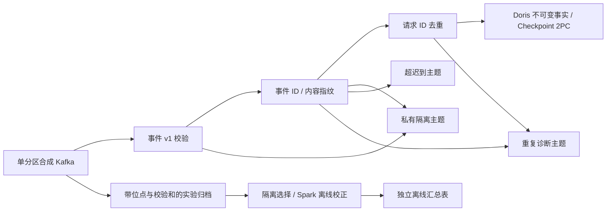

# 实时恢复与迟到校正

本轮使用 Flink 1.20.3 / Java 11、Kafka 3.9.1、Doris 3.0.6.2 与 connector 25.1.0，数据全部为合成样例。一个 4.5 GiB 分析 VM 承载实时组件，其他 VM 关闭；离线校正阶段切换到控制 VM 的 Spark 3.5.7 `local[2]`。没有把这个部署描述为多物理机容灾、连续生产调度或大规模吞吐测试。

## 已实现的处理边界



- 事件 v1 与公开汇总 v1 不变；新增校验只属于实验作业。不引入任何产品或轻量服务依赖。
- v2 作业要求一个采集序列代际和一个输入分区，在提交时检查分区数。生产扩展到多分区前，需要重新设计按业务键分区及首次接收顺序；不能把当前验收外推到该场景。
- 事件 ID 重放丢弃，内容冲突进入隔离；请求完成另按请求 ID 去重。前端观察事件不算请求完成，完成事件不得携带匿名访客字段。
- 去重状态使用处理时间 8 天 TTL。Doris 新事实表的 `business_version = Long.MAX_VALUE - seq`，使较早的同代际序号优先；它与旧样例的递增更新版本含义不同，必须使用新的独立表。不能重置同一 lane 的采集序列，也不能把任意更新当作不可变事件重放。
- 30 秒乱序 watermark；事件早于当前 watermark 减 10 分钟时进入私有迟到主题，恰好在边界上的事件仍可更新实时事实。重放的已知事件先去重，避免重复事件被当作新增迟到事实。
- 迟到主题保留经过白名单校验的事件信封，供离线修正；隔离消息只含固定原因，冲突/重复诊断含内部序号和事件 ID，不包含原始错误正文。它们不是公开接口。
- 三个旁路主题目前是至少一次投递；恢复可能重发诊断或迟到记录，离线必须再次按业务标识去重。本轮观察计数不能充当所有故障路径的原始消息恰好一次保证。

## Checkpoint 与事务

每 10 秒执行 EXACTLY_ONCE Checkpoint，超时 60 秒，最多一个并发 Checkpoint。固定算子 UID；Checkpoint 位于独立持久卷，保留最近三份，取消作业保留外部状态。TaskManager 故障采用 5 秒间隔、最多 10 次重启。JobManager 是普通 session 服务，没有 HA；它重启后需要重新上传相同 SHA256 的 JAR，并明确指定已保存的 Checkpoint 路径。

计算状态、外部提交和业务重复分别验收：

| 实验 | 实际结果 |
|---|---|
| 强制终止 TaskManager，并在恢复前追加事件 | 恢复 Checkpoint 与 Kafka 进度；首次请求日期/成功状态未被跨日重复覆盖 |
| 17 条边界输入 | 9 有效、2 超迟到、3 重复、3 隔离；基础日指标与独立基准一致 |
| 停止并启动 JobManager / TaskManager，手动指定 Checkpoint | 两级去重状态保留；再发送两个重复和一个新事件，只增加一条事实 |
| Doris DUPLICATE KEY 探针表的 2PC | PRECOMMITTED 时 0 行；ABORTED 后 0 行；VISIBLE 后 1 行；再次 commit 不变为 2 行 |
| Spark 校正累计 20 条归档输入 | 来源/契约/冲突隔离 3 条，17 条送入 Spark，12 有效 + 5 重复；Parquet 读回逐项匹配四行日汇总 |

2PC 重复 commit 的 HTTP 返回可能是 `ANALYSIS_ERROR` / already visible；实际事务状态与表中行数共同决定验收结果，不能只把 HTTP 200 当作成功。探针使用 DUPLICATE KEY 表，避免由主键合并掩盖重复提交。探针与实际 Flink Checkpoint 恢复是独立证据。

Checkpoint 保留和 Doris 流式提交约定分别参考 [Flink 1.20](https://nightlies.apache.org/flink/flink-docs-release-1.20/docs/dev/datastream/fault-tolerance/checkpointing/) 与 [Doris connector](https://doris.apache.org/docs/3.x/ecosystem/flink-doris-connector/)。恢复时沿用同一 lane / label 前缀与最新 Checkpoint；不能更换前缀绕过未处理的事务状态。

## 可复现操作

在 Windows 使用 `tools/maven_build.ps1` 构建，Java 11 字节码。20 个 Maven runtime JAR 的 SHA256 在 `lab/locks/flink-jars.json`；provided Flink / JDK 由镜像摘要覆盖。CI 在 Java 11 上运行测试并验证依赖集合：

```powershell
# Maven 命令在仓库根目录执行，输出路径相对 warehouse/flink。
mvn -B -q -f warehouse/flink/pom.xml org.apache.maven.plugins:maven-dependency-plugin:3.8.1:build-classpath -Dmdep.outputFile=../../runtime/flink-classpath.txt -DincludeScope=runtime
uv run python tools/verify_flink_dependencies.py --classpath runtime/flink-classpath.txt
```

关闭其他 VM，将分析 VM 配置为 `realtime`，启动后检查时钟与容量。首次配置在分析机使用 `lab/compose.analysis.yaml` + `lab/compose.olap-realtime.yaml` 创建 Doris 容器；应单独为可能的 BE 可写层复制预留至少 3 GiB。日常启动脚本只复用挂载匹配的已有 Doris 容器，避免不必要的重建。它不会自动压缩磁盘或清理数据。

在分析机忽略的 `lab/secrets/realtime.env` 写入独立实验配置，例如：

```dotenv
SNOW_REPLAY_LANE=recovery02
DORIS_TABLE=snow_realtime_recovery02.events_realtime
DORIS_USER=root
DORIS_PASSWORD=
```

该 root/空密码仅用于已有 NAT 实验 Doris，不能用于线上部署。Flink REST 绑定 VM `127.0.0.1:8081`，验收工具通过本项目已验证 SSH 主机公钥建立临时隧道。Kafka / Doris 是实验 VM NAT 接口，不是公开服务。

首次在分析机创建 Checkpoint 卷，只设置卷根目录所有者（不递归修改已有状态）：

```sh
. lab/locks/images.env
sudo docker volume create --label com.docker.compose.project=snow-lab-realtime --label com.docker.compose.volume=flink snow-lab-realtime_flink
sudo docker run --rm --user 0:0 --entrypoint sh -v snow-lab-realtime_flink:/checkpoints "$FLINK_IMAGE" -c 'chown flink:flink /checkpoints'
```

同步已加入 Git 索引的源码后，在分析机运行 `bash tools/start_realtime_node.sh`。宿主通过 `lab_remote.py --reserve-mib 1024` 执行启动脚本；首次创建 Doris 使用 `--reserve-mib 3072`。等待 Kafka / Doris / Flink 就绪，再在 Windows 运行：

```powershell
uv run --extra lab python tools/smoke_realtime.py --action init --lane recovery02
uv run --extra lab python tools/smoke_realtime.py --action run --lane recovery02
uv run --extra lab python tools/smoke_realtime.py --action restore --lane recovery02
uv run --extra lab python tools/verify_realtime_transactions.py --lane recovery02
uv run --extra lab python tools/prepare_realtime_correction.py --directory runtime/realtime/recovery02
```

已有验收 lane 保留，不应再次初始化；重新实验需更换 lane，并让 VM env 与命令参数一致。`init` 只允许补齐尚无消息的初始化；`run` / `restore` 发现已有作业收据会拒绝盲目重跑。`inspect` / `archive` 用于读回状态。`stop_realtime_node.sh` 先导出 Checkpoint 并取消合成作业，再停止明确列出的实验容器，不删除卷或主题。

离线阶段关闭分析 VM，启动控制 VM。将 `correction-events.jsonl`、`correction-expected.json`、`correction-input.json` 传入同名实验目录，在已固定的 Spark 镜像执行 `warehouse/spark/batch.py`：使用 `local[2]`、driver 1 GiB、容器上限 3 GiB，窗口 `2026-01-01..2026-01-02`，cutoff 取 `correction-input.json`；传入 `--expected` 与 `--package-file`，保留 Parquet 和 accepted 清单。隔离选择清单包含来源错误与被排除的序号，仍把重复记录交给 Spark 去重，没有预先聚合结果。

对应命令为 `bash tools/run_realtime_correction.sh recovery02 corrected01`（从宿主通过 `lab_remote.py --reserve-mib 1024` 调用）。此脚本针对上述固定日期边界样例；已存在验收包时拒绝覆盖。将验收包同步为 `runtime/realtime/recovery02/spark-correction.json`。关闭控制 VM，单独启动分析 VM 的已有 Doris 容器，再运行：

```powershell
uv run --extra lab python tools/verify_realtime_correction.py --lane recovery02 --directory runtime/realtime/recovery02
```

校正包先匹配独立基准，再以一次 INSERT 发布四行到该 lane 的 `daily_offline`。同一版本冲突或另一版本已存在时拒绝覆盖；重复发布结果相同。这是一个不可变实验校正批次，尚未接入 Airflow 连续 7 天回补或正式离线发布指针。

## 资源、发现与保留

- 实时 VM 4.5 GiB / 4 vCPU。Kafka 640 MiB、JM 896 MiB（进程 768 MiB）、TM 1536 MiB（进程 1280 MiB）、FE 1280 MiB、BE 1792 MiB。BE 内部限制最终为 1500M，JVM 256 MiB。容器上限合计大于 VM 内存，属于小样本按需占用配置，不是并发峰值保证；扩大负载前必须重新测量。
- 512 MiB JM 被 Flink 默认堆外/元空间预算拒绝；已提高为 768 MiB。BE 初始 1536 MiB 容器/1200M 内部阈值曾触发内存保护，后续分别提高容器和内部限额；不把失败的容量配置标记为通过。BE 参数使用[官方配置约定](https://doris.apache.org/docs/3.x/admin-manual/config/be-config/)，不可动态修改的值通过停止/启动已有容器生效。
- Java 11 的 `Instant.parse` 未接受本轮 `+00:00` 时间戳，而本机较新 JDK 测试通过；改为 `OffsetDateTime.parse(...).toInstant()` 并添加回归样例。失败的 `recovery01` 数据与 Checkpoint 仍保留，成功验收使用 `recovery02`。
- 分析系统盘逻辑容量由 24 扩至 28 GiB，真实总预算没有上调。一次 Doris 容器重建导致已释放的旧块仍占据 VMDK，项目文件达 60.81 GiB，作业门禁拒绝继续，尚未发送验收事件。
- 维护时仅写入再移除本项目的 2560 MiB 零值临时文件，离线回收空闲块，数据与历史保留。**VMware 压缩工具还创建了临时磁盘副本，期间宿主 35 GiB 余量门禁失败；这次维护不能计作全程资源预算合格。** 新增 `tools/compact_vm_disk.py` 默认仅审阅，同时计算完整临时副本的项目占用与宿主余量；不足时即使指定 `--execute` 也拒绝。禁止绕过检查重做压缩。
- 资源与停用范围在 `deploy/resources.json`。本轮没有生产数据、产品适配变更、公开接口变更或 Kafka/HDFS HA 声明；在线接收至 Doris 的 P95、持续负载、8 天 TTL 到期实测与多分区一致性仍待验收。

最后审查补充了 schema_version 整数溢出拒绝及单元回归；未改变状态或输出结构。收据分别记录恢复实验 JAR 与最终构建 JAR 的 SHA256，避免把先前运行冒充新二进制验收。

实际引擎收据与已验证/未验证边界见 [实施状态](status.md) 和 [验收收据](evidence/realtime.json)。
